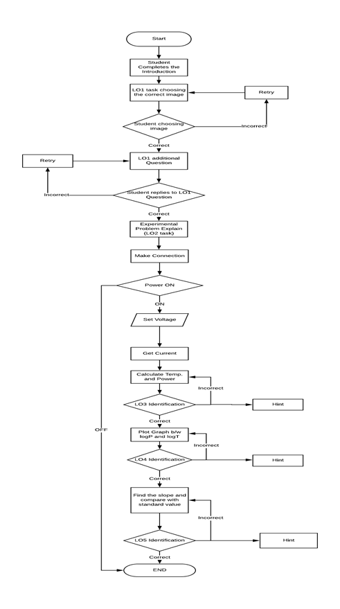
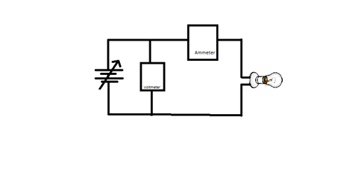
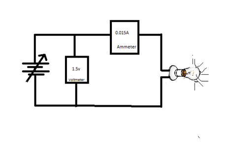
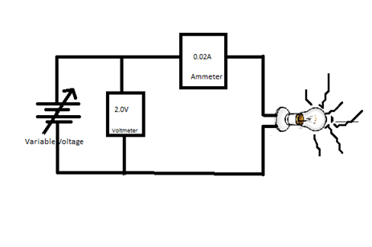
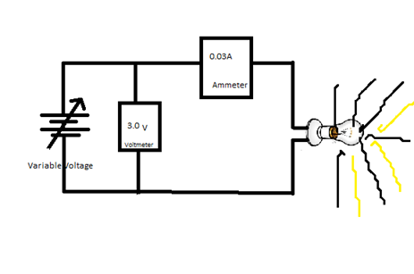
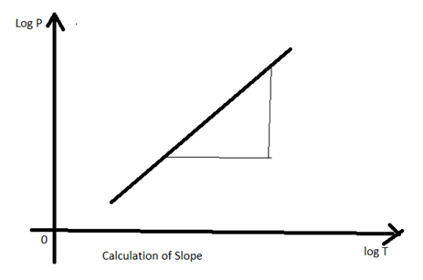

## Storyboard (Round 2)

Experiment 1:  To verify Stefan's Law

### 1. Story Outline:

All the sources at temperature above than the atmospheric temperature radiate energy. The rate of Energy emission from such bodies depends on conditions such as temperature surface area and emissivity of the body. According to Stefan’s Law the rate of energy emission from any-body having temperature above than the temperature of the atmosphere is directly proportional to the fourth power of the absolute temperature of the body.
Filament of any glowing electric bulb can be the body in which Stefan’s law can be observed. For this purpose simple circuit containing power source voltmeter, ammeter and an electric bulb is required. Simple electrical circuit to perform experiment for verification of Stefan’s Law is shown in the figure3. Figure 4 shows that on increasing potential difference applied across the filament the current in the circuit increases simultaneously the glow of the bulb increases due to the increased rate of heat dissipation. As a consequence of this heat the resistance and the temperature of the filament increases. On further increasing the applied potential difference the current in the circuit, glow the bulb increases this situation is indicated in the figure 5 and figure 6. If we plot a graph between the logarithmic of power radiated from the filament and the logarithmic of the Temperature of the filament, the graph appears to be straight line. This nature of the graph is indicated in figure 7. By calculating the slope this graph one can observe that the Stefan’s law is valid. 

### 2. Story:

#### 2.1 Set the Visual Stage Description:
1.	Make connections to complete the circuit.
2.	Slide the power to ON mode.
3.	Increase the voltage from 0 V with an increase of 0.5 V till 9.5 V.
4.	Measure the corresponding current in ammeter.
5.	Fetch the values of current and voltage in Table 1 after every step.
6.	Take 10 observations.
7.	Decrease the voltage from 10.0 V with a decrease of 0.5 V till 1.0 V.
8.	 Fetch these values of current and voltage in Table 1.
9.	Value of R0 will be calculated.
10.	Take observations from Table 1 and place them in Table 2 by the Fetch button.
11.	Values of LogP and LogT will be calculated.
12.	Plot graph between LogP and Log T by plot data button.
13.	Calculate the slope of the graph.

#### 2.2 Set User Objectives & Goals:
 1.	To recall and complete the electrical circuit of the Stefan’s Law experimental Setup.
2.	Follow step by Step Procedure to complete the experiment.
3.	To study how to plot the data from the Table.
4.	To calculate the slope of the graph.
5.	To observe the Straight line plot between Log P and Log T and to verify Stefan’s Law.

#### 2.3 Set the Pathway Activities:
1. Complete the circuit connections.
2. Switch the power button to ON position.
3. Set the voltage from the slider.
4. Fetch the data to Table1.
5. Entries in the Table1 will be automatically filled after this step and the value of R0 will be calculated.
6. Fetch data to Table 2 where value of R0 will be used and the value of the temperature will be calculated. Also values of logP and logT will be generated. 
7. Plot the graph between logP and logT  which will be nearly straight line.
8. Calculate the slope of the graph which will be approximately 4 and will prove Stefan’s Law.

##### 2.4 Set Challenges and Questions/Complexity/Variations in Questions:

1. Student will be asked questions based on various cognitive levels. List of Questions provided in Round1 document.
2. Student will be asked to solve questions base on Table1, Table2 and the final graph plotted.

##### 2.5 Allow pitfalls:
1. Simulator will allow making wrong connections but incase of wrong connections the circuit will not work and an alert message will appear that the connections are wrong. He can take help from the help button to get the information on the proper connections to be made.
2.  Student will be allowed to calculate slope from the plotted graph by clocking on the graph at two different points on the graph. If the student touches the points on the sheet other than the line a message will appear to choose the points on the graph.
3. At last after the slope is calculated student will get a message about percentage error occurred. If this error is more than 10% a message will appear “perform experiment again your experiment is ---%”. If the error is less than 10% message will display “Hence Stefan’s Law is proved”. 

##### 2.6 Conclusion:

##### 2.7 Equations/formulas: NA
When the student will enter the value of voltage V(in volts), assuming the variation of the filament resistance with temperature, corresponding value of the current (in mA) will be calculated according to the equation 
					I = 5*V+15						(1)
Corresponding value of the Resistance in Ohms will be calculated using Ohm’s law:
R=V/I							(2)
Power in the filament will be calculated according to the relation:
					P=V*I							(3)
Average of 10 resistance values calculated from Eq. (2) will be divided by 3.9 to get the average value of R0 (resistance of the filament at 0K). Each resistance value is divided by R0 to get the value of Rt/R0. Following correlation will be used to calculate the temperature(in K) of the filament corresponding to each value of Rt/R0:
					T= (-2.613)*( Rt/R0)^2 + 85.78* (Rt/R0) + 434.8	(4)
Log T and Log P values will be calculated and then a plot between Log P(on y axis) and Log T (on x axis) will be drawn. The plot will be nearly straight line, slope of this plot will be calculated. Value of the slope of this curve will come approx 4 and hence Stefan’s Law will be proved. 

### 3. Flowchart 4

### 4. Mindmap:

 

### 5. Storyboard :
 
 
 
 

